<h2 align="center">
    <a href="https://dainam.edu.vn/vi/khoa-cong-nghe-thong-tin">
    🎓 Faculty of Information Technology (DaiNam University)
    </a>
</h2>
<h2 align="center">
   GIẢI PHÁP CHUYỂN ĐỔI SỐ TRONG THEO DÕI LUYỆN TẬP THỂ THAO VÀ DINH DƯỠNG CÁ NHÂN
</h2>
<div align="center">
    <p align="center">
        
        
        
    </p>

[](https://www.facebook.com/DNUAIoTLab)
[](https://dainam.edu.vn/vi/khoa-cong-nghe-thong-tin)
[](https://dainam.edu.vn)

</div>


## 1. 📖 GIỚI THIỆU

**GYMNOW** là ứng dụng quản lý gym và fitness thông minh, được phát triển dưới dạng **ứng dụng di động** sử dụng Flutter, giúp người dùng theo dõi, quản lý và tối ưu hóa quá trình tập luyện và dinh dưỡng của mình một cách hiệu quả. Ứng dụng nổi bật với việc tích hợp **Trí tuệ Nhân tạo (AI)** thông qua Chatbot **PT AI**, mang đến trải nghiệm tập luyện và dinh dưỡng mang tính cá nhân hóa cao.

### ✨ Tính năng nổi bật:

* **Quản lý Tập luyện (Workout):**
    * Tạo và quản lý các bài tập tùy chỉnh.
    * Theo dõi lịch sử tập luyện với nhật ký chi tiết.
    * Đặt mục tiêu tập luyện và theo dõi tiến độ.
    * Hỗ trợ nhiều loại bài tập: Cardio, Strength, Flexibility, v.v.
* **Theo dõi Sức khỏe:**
    * **Đếm bước chân** tự động bằng cảm biến.
    * **Đo nhịp tim** thời gian thực.
    * Theo dõi hoạt động hàng ngày.
* **Quản lý Dinh dưỡng:**
    * Tìm kiếm và quản lý thực phẩm với thông tin dinh dưỡng chi tiết.
    * **Phân tích ảnh món ăn** bằng AI để ước tính calo và macro.
    * Tạo và quản lý **kế hoạch ăn uống (Meal Plan)** tùy chỉnh.
    * Đặt mục tiêu dinh dưỡng (calo, protein, carbs, fat).
    * Theo dõi lịch sử ăn uống theo ngày.
* **Thống kê và Báo cáo:**
    * Xem thống kê tập luyện và dinh dưỡng theo **tuần, tháng, năm**.
    * Hiển thị qua **biểu đồ trực quan** với FL Chart.
    * Theo dõi tiến độ đạt mục tiêu.
* **Trợ lý Fitness AI - Chatbot PT AI:**
    * Được xây dựng trên **Gemini 2.5 Flash Lite** để phân tích và tư vấn.
    * Cung cấp **lời khuyên tập luyện và dinh dưỡng cá nhân hóa** dựa trên thông tin người dùng (chiều cao, cân nặng, BMI, mục tiêu).
    * **Phân tích ảnh** để nhận diện món ăn và ước tính dinh dưỡng.
    * Hỗ trợ **nhập liệu bằng giọng nói** (Speech-to-Text).
    * Lưu lịch sử chat trên Firestore.
* **Quản lý Người dùng:**
    * Đăng ký, đăng nhập với Firebase Authentication.
    * Quản lý hồ sơ cá nhân.
    * **Admin Panel** để quản lý người dùng.
    * Quên mật khẩu với xác thực email qua SendGrid.
* **Tính năng khác:**
    * **Google Maps** tích hợp để tìm phòng gym gần nhất.
    * **Thông báo local** nhắc nhở tập luyện.
    * Hỗ trợ đa ngôn ngữ (Tiếng Việt).
    * Kiểm tra kết nối mạng thời gian thực.


## 2. 💻 CÔNG NGHỆ SỬ DỤNG

### Frontend (Mobile App)
<p align="center">
  
  
  
</p>

### Backend
<p align="center">
  
  
  
  
</p>

### AI & Services
<p align="center">
  
  
  
</p>

### Các Package & Thư viện chính:
- **Firebase**: `firebase_core`, `firebase_auth`, `cloud_firestore`, `firebase_storage`
- **UI & Charts**: `fl_chart`, `flutter_chat_ui`
- **Sensors**: `pedometer`, `heart_bpm`, `geolocator`
- **Media**: `image_picker`, `speech_to_text`
- **Utilities**: `shared_preferences`, `http`, `intl`, `uuid`


## 3. 🚀 HƯỚNG DẪN CÀI ĐẶT

### Cập nhật mới nhất
- Thêm xác thực PIN và đặt lại mật khẩu trực tiếp trên Firebase qua Backend (không gửi link).
- Cải tiến thông báo: SnackBar đồng bộ phong cách, cảnh báo mạng toàn cục.
- Nâng cấp UI: AppBar đồng màu khi cuộn, ẩn hiện AppBar trong Nhật ký bằng SliverAppBar.
- Bản đồ chi tiết buổi tập: vẽ lại lộ trình theo vận tốc, thêm công tắc bật/tắt “số đánh dấu vận tốc” dọc tuyến.
- Local Notifications: cảnh báo khi vượt mục tiêu dinh dưỡng.
- Sửa lỗi Android build bằng core library desugaring.

### 📋 Điều kiện tiên quyết
- Đã cài đặt **Flutter SDK** (phiên bản 3.9.0 trở lên).
- Đã cài đặt **Node.js** và **npm**.
- Đã tạo dự án **Firebase** và cấu hình:
    - Firebase Authentication
    - Cloud Firestore
    - Firebase Storage
    - Firebase Admin SDK (serviceAccountKey.json)
- Bạn cần có:
    - **API Key của Gemini 2.5 Flash** (hoặc Gemini 2.5 Flash Lite).
    - **SendGrid API Key** (cho tính năng gửi email).
    - **Google Maps API Key** (cho tính năng bản đồ).

### 🔧 Các bước cài đặt

#### 1. **Clone repository:**
```bash
git clone <repository-url>
cd gym_now
```

#### 2. **Cấu hình Firebase:**
- Tải file `google-services.json` (Android) và `GoogleService-Info.plist` (iOS) từ Firebase Console.
- Đặt `google-services.json` vào `android/app/`.
- Đặt `GoogleService-Info.plist` vào `ios/Runner/`.
- Đặt `serviceAccountKey.json` vào thư mục `gym_now_backend/`.

#### 3. **Cấu hình Backend (.env):**
- Tạo file `.env` trong thư mục `gym_now_backend/`.
- Sao chép và điền thông tin:
```env
# Port server
PORT=3000

# Gemini AI API Key
GEMINI_API_KEY=thay-thế-API-Key-của-bạn-vào-đây

# SendGrid API Key (cho tính năng gửi email)
SENDGRID_API_KEY=thay-thế-SendGrid-API-Key-của-bạn-vào-đây

# Email gửi đi (phải được verify trong SendGrid)
EMAIL_FROM=noreply@GYMNOW.com

# Firebase Admin SDK (tự động đọc từ GOOGLE_APPLICATION_CREDENTIALS)
# Đảm bảo serviceAccountKey.json đã được đặt đúng vị trí
```

#### 4. **Cài đặt và Khởi động Backend:**
```bash
cd gym_now_backend
npm install
node server.js
```
Server sẽ chạy tại `http://localhost:3000` (hoặc port được cấu hình trong `.env`).

#### 4.1. (Tùy chọn) Triển khai Backend lên Render
> Dự án tương thích triển khai trên `Render.com` (Web Service).

1) Push mã nguồn lên GitHub (thư mục `gym_now_backend/`).
2) Trên Render, tạo New → Web Service → kết nối repository.
3) Thiết lập:
   - Root Directory: `gym_now_backend`
   - Runtime: Node
   - Build Command: `npm install`
   - Start Command: `node server.js`
   - Environment:
     - `PORT` (Render tự set), `GEMINI_API_KEY`, `SENDGRID_API_KEY`, `EMAIL_FROM`
     - Tải `serviceAccountKey.json` lên Render (Secret File) và đặt biến
       `GOOGLE_APPLICATION_CREDENTIALS=/opt/render/project/src/gym_now_backend/serviceAccountKey.json`
4) Deploy. Lưu lại `https://<service-name>.onrender.com` để cấu hình app mobile.

##### Các endpoint backend chính
- `POST /sendPinEmail` — Gửi mã PIN đến email người dùng (SendGrid).
- `POST /verifyPin` — Kiểm tra mã PIN (Firestore).
- `POST /resetPassword` — Đặt lại mật khẩu trực tiếp bằng Firebase Admin.
- `POST /chat/ai` — Tư vấn PT AI (Gemini).

#### 5. **Cài đặt và Khởi động Flutter App:**
```bash
# Quay về thư mục gốc
cd ..

# Cài đặt dependencies
flutter pub get

# Chạy ứng dụng
flutter run
```

#### 6. **Cấu hình Google Maps (Tùy chọn):**
- Lấy Google Maps API Key từ [Google Cloud Console](https://console.cloud.google.com/).
- Cập nhật API Key trong `android/app/src/main/AndroidManifest.xml`:
```xml
<meta-data android:name="com.google.android.geo.API_KEY"
           android:value="YOUR_API_KEY_HERE"/>
```

📌 **Lưu ý:**
- Đảm bảo Firebase đã được khởi tạo đúng cách trong `lib/firebase_options.dart`.
- Kiểm tra kết nối mạng trước khi sử dụng các tính năng cần internet.
- Đối với Android, cần cấp quyền truy cập vị trí, camera, microphone trong `AndroidManifest.xml`.
- Đối với iOS, cần cấu hình quyền tương ứng trong `Info.plist`.

## 4. 📸 HÌNH ẢNH CHƯƠNG TRÌNH

- Giao diện đăng ký, đăng nhập, quên mật khẩu, đặt lại mật khẩu:
    <p align="center">
    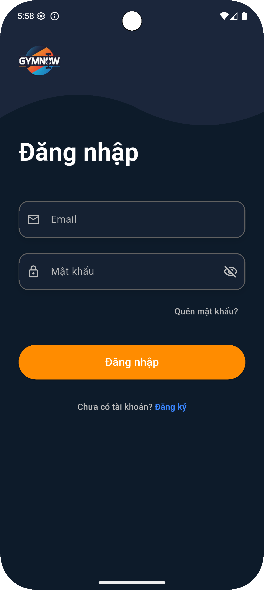
    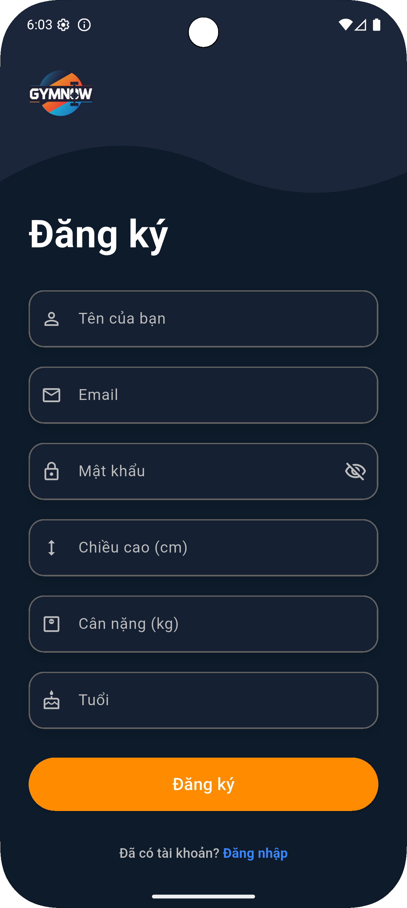
    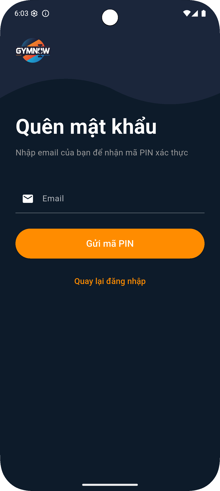
    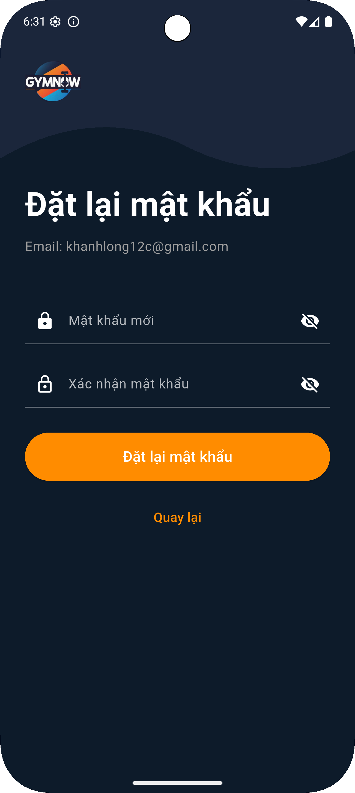
    </p>

- Giao diện trang chủ, chế độ tập luyện, mục tiêu tập luyện:
    <p align="center">
    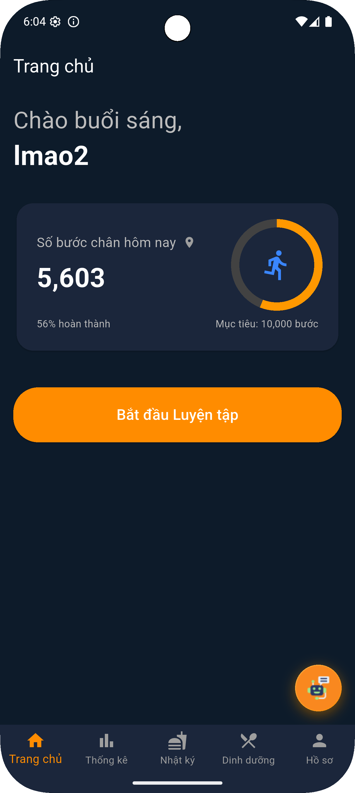
    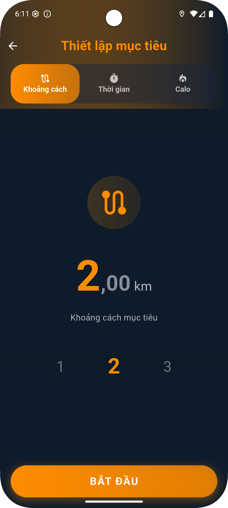
    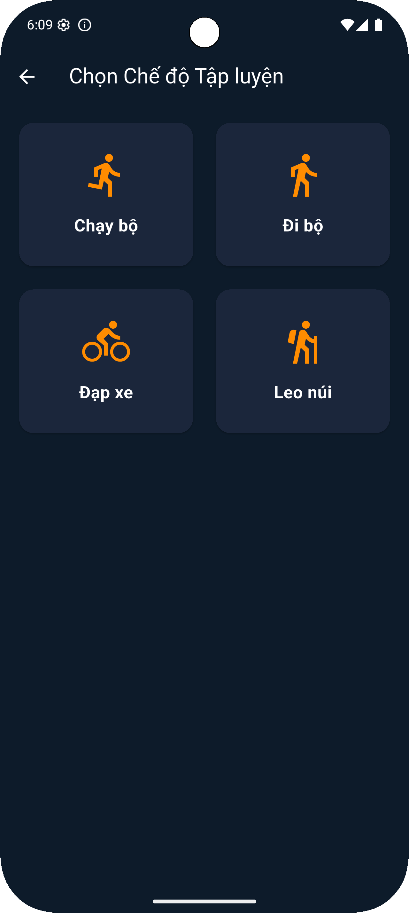
    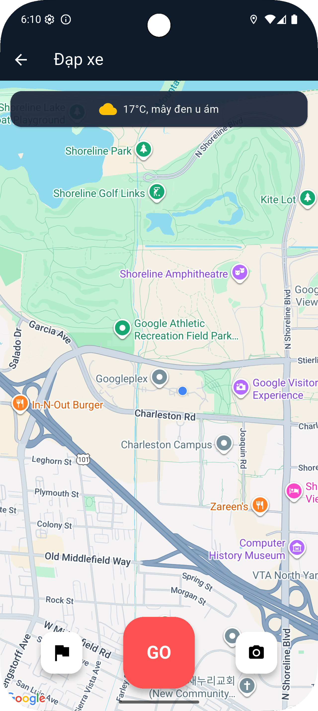
    </p>

- Giao diện quản lý dinh dưỡng và mục tiêu dinh dưỡng:
    <p align="center">
    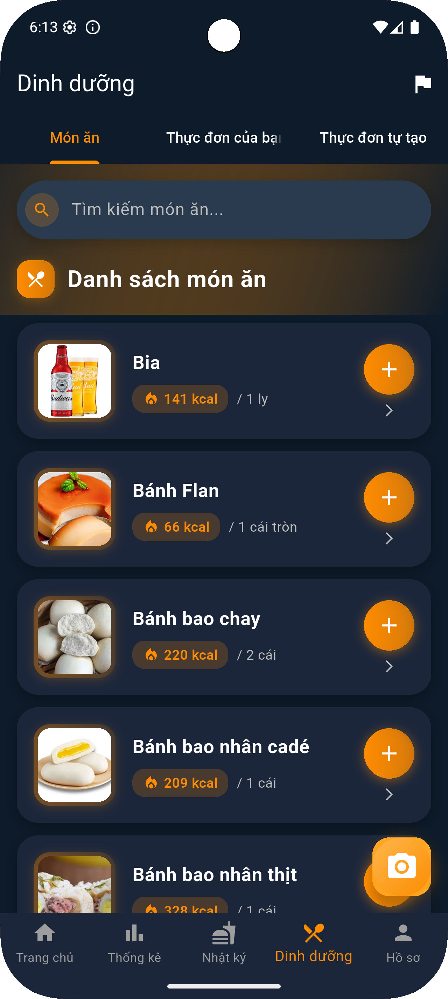
    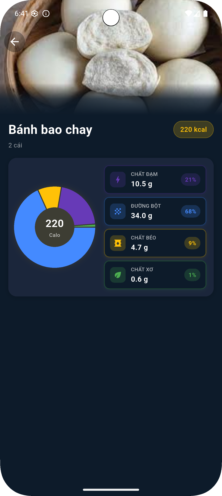
    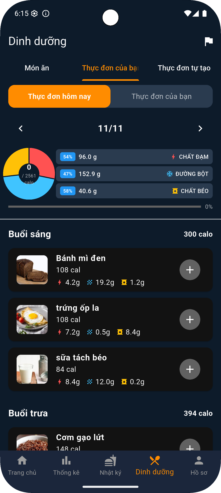
    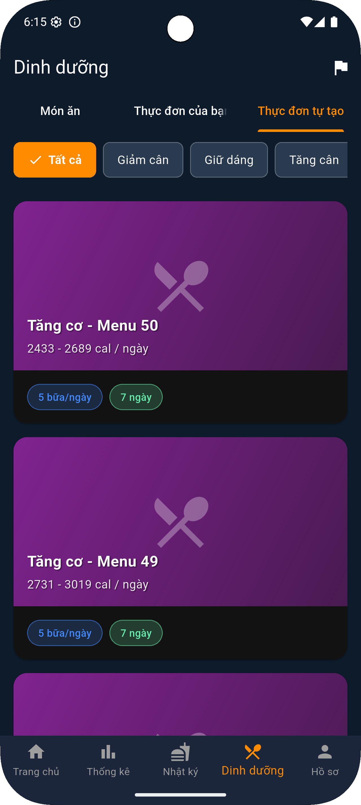
    
    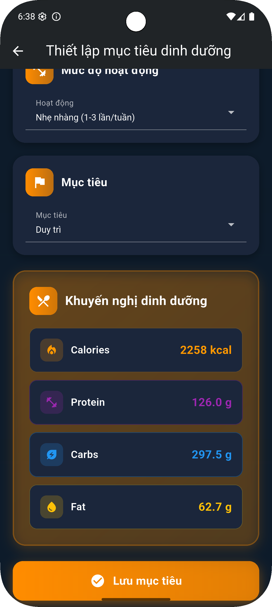
    </p>

- Giao diện thống kê:
    <p align="center">
    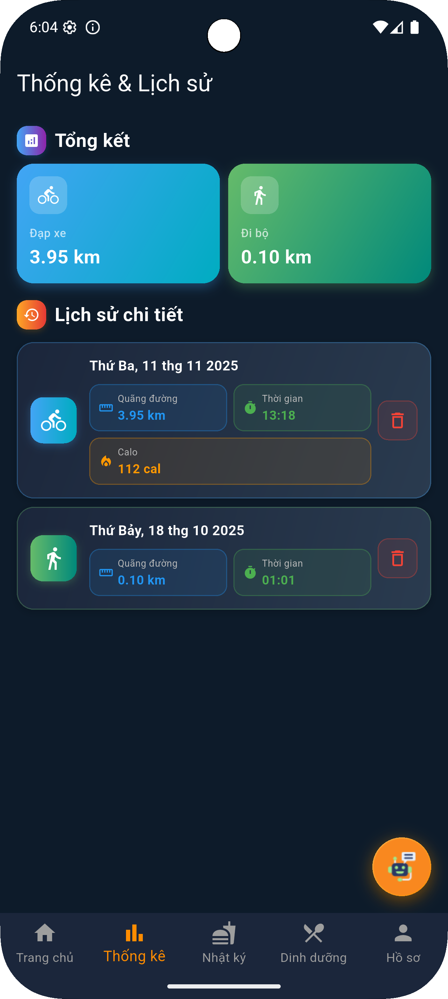
    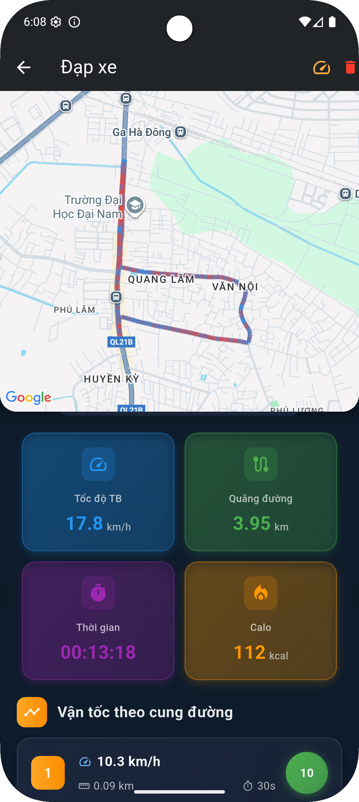
    </p>

- Giao diện Chatbot PT AI và phân tích hình ảnh:
    <p align="center">
    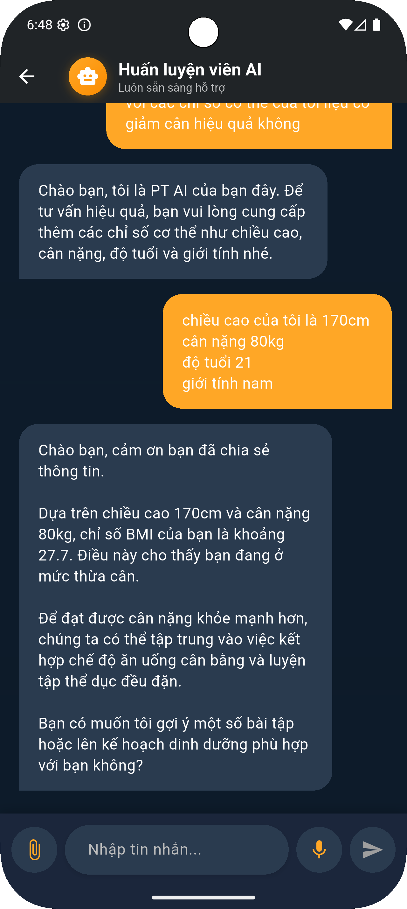
    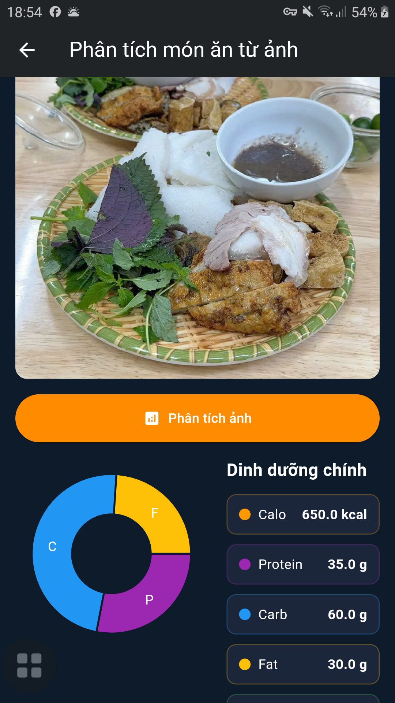
    </p>
- Giao diện nhật kí và hồ sơ
<p align="center">
    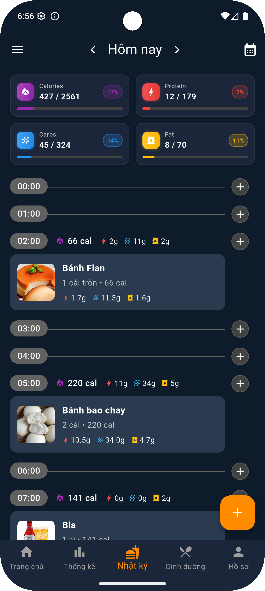
    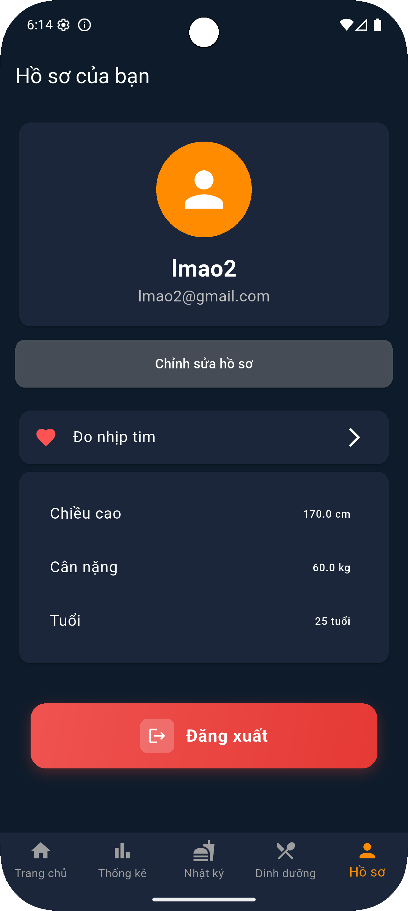
    </p>

## 5. 📞 Liên hệ: 
| Trường thông tin         | Nội dung                                 |
|-------------------------|-------------------------------------------|
| **🏛️ Trường**           | Đại học Đại Nam (DaiNam University)      |
| **💻 Khoa**              | Công nghệ Thông tin                      |
| **📚 Môn học**           | Chuyển đổi số                            |
| **👤 Sinh viên**         | Lê Đức Khánh Long                            |
| **📧 Email**             | longhjk345@gmail.com                     |
| **Lớp**                 | CNTT 16-03                               |
| **Năm học**             | 2025-2026                                |

---

<div align="center">
    <p><strong>© 2025 DaiNam University - Faculty of Information Technology</strong></p>
    <p>All rights reserved.</p>
</div>
